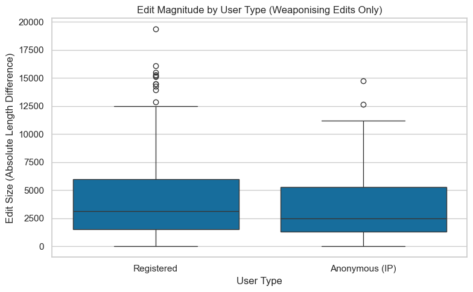
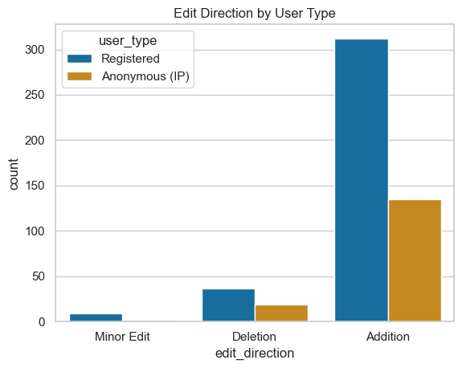

# 🧾 Results — Midterm Analysis (28 Oct. 2025)

## 1. Motivation  

In the file `Wikipedia_articles.txt`, we gathered around **340 Wikipedia articles** related to **Ukrainian and Russian culture, history, and politics**.  

By retrieving all the edits made to these articles, we aim to identify **patterns of activity** — for instance, peaks in editing activity during major historical or geopolitical events.  


### Observed Peaks of Activity

Distinct peaks can be identified around several key periods:

- **2005–2008** → Post–Orange Revolution period, marked by Russo-Ukrainian gas disputes and general geopolitical tension. This era also coincides with Wikipedia’s “golden age,” with roughly **50,000 active users** at its 2007 peak.  
- **2014** → The **Russian annexation of Crimea**.  
- **2020–2021** → The **COVID-19 pandemic**, which likely increased online activity overall.  
- **2022–2025** → The **large-scale Russian invasion of Ukraine**, generating global attention and narrative conflict.  

These observations motivate a deeper investigation into **editor behavior and content modification patterns**.

---

## 2. Research Structure  

This midterm analysis is divided into two complementary parts:

1. **Weaponised vs. Non-Weaponised User Analysis**  
   A global overview of editing patterns among a sample of **2,454 unique users**, distinguishing between edits classified as *weaponising* or *non-weaponising*.

2. **Weaponising Users — Fine-Grained Analysis**  
   A focused investigation of **300 unique users** from the *fine-grained dataset*, restricted to edits identified as weaponising by the language model.

---

## 3. Weaponised vs. Non-Weaponised User Analysis  

This section is based on the file `matched_edits_all.csv`, produced by **Emanuela**, which aligns fine-grained edits with corresponding user data from the *LLM Results* folder.  
One can first check how *Weaponising* VS *Non weaponsing* edits are distributed over time.


There is a clear correlation with the first graph, showing more edits on crucial geopolitical periods as well as a peak of weaponsing edits. No peaks are displayed for the 2022-2025 periods since no article in the dataset was about Russian large scale invasion in Ukraine.

### Metadata of the `matched_edits_all.csv`

```python
{'total_edits': 45697,
 'total_unique_users': 2454,
 'number_unique_articles': 41,
 'num_bot_users': 92,
 'num_anonymous_users': 1011,
 'num_registered_users': 1351,
 'num_bot_edits': 1376,
 'num_anonymous_edits': 8315,
 'num_registered_edits': 36006,
 'weaponised_edits': 8388,
 'non_weaponised_edits': 37278,
 'unknown_weaponised_edits': 31}
```

There is a lot we can analyse coming from this metadata. We first start to focus on the **registered** users and specially the top 10 most frequent editors among the 1351 registered users.

### Top 10 users general info

The top 10 registered editors are : 
```python
['LSGH',
 'Toddy1',
 'TheDraperyFalls',
 'UP9',
 'Genyo',
 'Aleksandr Grigoryev',
 'Dbachmann',
 'Vasile',
 'Irpen',
 'Mzajac']
```

#### Proportion regarding Ur/Ru articles

To identify how much each of the top 10 users focused on Ukraine- or Russia-related content, I filtered their edited articles using both small and large sets of keywords related to these two countries.

```python
ukraine_keywords_small = [
    "ukraine", "ukrainian", "kyiv", "kiev", "crimea", "crimean", "kuban", "donbas", "donetsk", "luhansk",
    "maidan", "yanukovych", "yushchenko", "zelenskyy", "poroshenko", "catherine", "bukovina", "bessarabia", "eastern",
    "euromaidan", "dnipro", "odessa", "sevastopol", "putin", "rus'", "russia", "russian", "moscow", "kremlin", "soviet"
]

ukraine_keywords_large = [
    # core country and people
    "ukraine", "ukrainian", "kyiv", "kiev", "crimea", "crimean", "kuban", "donbas", "donetsk", "luhansk",
    "maidan", "yanukovych", "yushchenko", "zelenskyy", "poroshenko", "catherine", "bukovina", "bessarabia",
    "eastern", "euromaidan", "dnipro", "odessa", "sevastopol", "putin", "rus'", "russia", "russian", "moscow",
    "kremlin", "soviet",

    # politics & government
    "verkhovna rada", "president", "prime minister", "parliament", "government", "cabinet", "federation",
    "referendum", "annexation", "independence", "revolution", "reforms", "corruption", "sanctions",
    "occupation", "treaty", "agreement", "ceasefire", "negotiations", "elections", "coup", "unification",

    # geography & regions
    "zaporizhzhia", "mariupol", "kharkiv", "kherson", "mykolaiv", "chernihiv", "sumy", "poltava", "vinnytsia",
    "lviv", "ivano-frankivsk", "ternopil", "lutsk", "uzhhorod", "dnipropetrovsk", "donetsk oblast",
    "luhansk oblast", "transcarpathia", "prykarpattia", "galicia", "novorossiya", "black sea", "azov sea",

    # historical references
    "kyivan rus", "tsar", "imperial", "empire", "ussr", "communist", "lenin", "stalin", "bolshevik",
    "cold war", "perestroika", "glasnost", "collapse", "partition", "catherine the great", "brezhnev",
    "chernobyl", "orange revolution", "revolution of dignity", "holodomor", "soviet union",

    # war and military
    "invasion", "occupation", "annexed", "frontline", "offensive", "defense", "army", "forces", "military",
    "russian troops", "ukrainian forces", "separatist", "rebels", "paramilitary", "nato", "eu", "un", "war",
    "conflict", "shelling", "bombing", "airstrike", "occupation forces", "mobilization", "martial law",

    # culture, identity & language
    "language", "identity", "heritage", "culture", "orthodox", "church", "patriarch", "ukrainian language",
    "russian language", "minority", "bilingual", "autonomy", "nationalism", "independence day", "flag",
    "anthem", "symbol", "national identity", "sovereignty",

    # current / modern references
    "donbas war", "russian invasion", "ukrainian front", "crimea bridge", "moskva cruiser", "ukrainian army",
    "russian army", "zelensky", "kremlin propaganda", "occupation administration", "territorial defense",
    "european union", "eu membership", "nato membership", "nato expansion", "eu sanctions", "ukraine war",
    "full-scale invasion", "special military operation", "mobilisation", "referendum in crimea",

    # other
    "gas pipeline", "north stream", "energy crisis", "grain corridor", "black sea fleet", "peace talks",
    "donetsk people's republic", "luhansk people's republic", "kyiv oblast", "liberation", "resistance",
    "occupation zone", "ukrainian refugees", "mariupol steel plant", "azovstal", "bucha", "irpin", "kharkiv offensive"
]
```

I did the analysis for a sub sample of 1000 analysis per user and for all the edits the user made since the creation of his account using Wikipedia's user API. 

With the small set for 1000 edits per user :

<p align="center">

</p>

With the large set for 1000 edits per user :

<p align="center">

</p>

With the small set for every edits per user :

<p align="center">

</p>

With the large set for every edits per user :

<p align="center">

</p>

#### Weaponsing edits vs non weaponising edits per year for top 10 for only Ur/Ru related article

<p align="center">

</p>

The graph shows that while Dbachmann seldom edits Ukraine- or Russia-related pages, those few edits are more likely to be weaponising compared to others.
In general, these top users are broad Wikipedia contributors, with limited focus on Ukraine/Russia topics and little evidence of weaponising behaviour.

#### Groups

| Group               | Who it includes   | Typical criteria     | Can edit semi-protected pages? | Can edit extended-protected pages? |
| ------------------- | ----------------- | -------------------- | ------------------------------ | ---------------------------------- |
| `*`                 | Anyone (even IPs) | none                 | ❌                             | ❌                                 |
| `user`              | Registered users  | account created      | ✅                             | ❌                                 |
| `autoconfirmed`     | Older + ≥10 edits | ~4 days, ≥10 edits   | ✅                             | ❌                                 |
| `extendedconfirmed` | Sustained editors | ≥30 days, ≥500 edits | ✅                             | ✅                                 |

> hard to get some relevant information for only the top 10 users. Maybe will me more relevant when focus only on the weaponising users for the fiengrained file.

### Registered vs IP adress users

The file, as displayed in the metadata, includes 2,454 unique users, of which:
* 1,351 are registered accounts
* 1,011 are anonymous (IP addresses)
* 92 are bots
  
Although the number of registered and anonymous users is roughly comparable, the volume of edits differs significantly:
* Registered users: 36,006 edits
* Anonymous users: 8,315 edits

This implies that registered users contribute over four times more edits than anonymous users. Thus we can raise the following research question
> **Are anonymous (IP address) users more likely to produce weaponising edits compared to registered users due to their anonymity?**

The graph below shows that in proportion, IP adress user are slighlty more weaponsing than registered user. They feel maybe more confortable to weaponise under anonymity.

<p align="center">

</p>

As we did for the top 10 registered users, we can also see how much edits and when the top 10 anonymous users are weaponising or not. As seen in the plot, we can see that the numbers of edits is way lower than the top 10 registered user and all of the top 10 IP adresse without exception are pnly editing during a single year, whcih is different than the registered users where the most of them are editing for a longer time frame.

<p align="center">

</p>

By using an IP Geolocation API, we can check wether the used IP adress is from a proxy or not and where the edit is located :

🌍 [View Interactive IP Map](https://maximegrmbs.github.io/dhlab-cultural-weaponisation-ukraine-benchmark/blob/main/plots/ip_locations_map.html)

--- 

## 3. Weaponised User Analysis  

After analysing weaponised vs. non-weaponised edits for both registered and anonymous users, we can now go a step deeper and focus exclusively on the **users who have been classified as weaponising**.  
This allows us to explore not only *who* is weaponising, but also *how* different types of users (registered vs. anonymous) engage in specific forms of weaponisation.  

> **Note:** Unfortunately, I was not able to retrieve either the articles or the timestamps corresponding to the edits.

### Metadata of the `matched_edits_all.csv`

```python
{'total_edits': 513,
 'total_unique_users': 397,
 'num_bot_users': 9,
 'num_anonymous_users': 146,
 'num_registered_users': 242,
 'num_bot_edits': 11,
 'num_anonymous_edits': 156,
 'num_registered_edits': 346}
```

From the ```fg_user_known.csv``` file, we identify almost 400 weaponising users — including 146 anonymous (IP-based) editors and 242 registered editors.

### Top 10 users general info

The top 10 registered editors are : 
```python
['Aleksandr Grigoryev',
 'RGloucester',
 'Yulia Romero',
 'Dbachmann',
 'Lvivske',
 'JASpencer',
 'Kuban kazak',
 'Irpen',
 'Mzajac',
 'Seryo93']
```

As expected, no IP addresses appear in this top 10. Some usernames have already appeared in the previous ranking, suggesting that a few users are consistently active across different subsets of edits. One can may proove those kinf of behaviour in the next chapter "Graph".

To further characterise editing behaviour, we can ask:

> Do IP address editors are more concise and harmful than registered users ?

### Category of weaponisation per user type

This categroy is driven by the following RQ:
> How do registered and anonymous users differ in the type of weaponising strategies they employ?

The graph below shows an interesting distribution of weaponisation categories across user types. On one hand, registered users appear to favour **Framing and Emphasis Shifts*** : a technique that often involve adding context, rewording, or subtly reframing information to promote a particular point of view. These users generally produce longer edits and seem to embed manipulative intent in more sophisticated ways.
On the other hand, anonymous users (IPs) tend to rely more on **Selective Insertion**, a strategy that typically consists of short, targeted, and often more direct interventions. This pattern suggests that anonymous users might engage in quicker, less nuanced, but potentially more disruptive forms of manipulation.

<p align='center'>
   
</p>

#### A. Edit Magnitude

In order to emphase more this behaviour, one can perform a boxplot of edits magbnitude per user type by checking the lenght of the ```changed_version``` vs the length of the ```inital_version``` :

<p align='center'>
   
</p>

The median weaponising edit size was comparable between registered and anonymous users, though registered users exhibited a greater variance and more extreme outliers.
This suggests that while both groups engage in manipulative micro-edits (e.g., terminology shifts or short insertions), registered users occasionally perform larger structural interventions — possibly reframing or rewriting entire paragraphs.
In contrast, anonymous users tend to contribute smaller, localized edits (consistent with quick, opportunistic interventions).

Maybe a good idea to assess the statistical significance of this results by calculating the p-value for both groups. So we suppose that the two groups does not provide a significal difference. By using Mann-Whitney U test i.e ```mannwhitneyu``` from scipy.stats module, we find a p-value of **0.03180**. This indicates that the observed difference between the two groups would occur by chance less than 3% of the time — providing moderate evidence of a statistically meaningful distinction in their editing behaviours.

#### B. Change Direction

We can classify edits as Additions (positive Δlen), Deletions (negative Δlen), or Rewrites (± small Δlen) and compare distribution by user type. By folowing this question :

> Are IPs more likely to add new sentences (insertions) or remove content (deletions)?

This graph shows no real 
<p>
   
</p>

#### C. Lexical & Semantic Analysis

Possible to analyse the sentiment polarity and toxicity by using model like ```cardiffnlp/twitter-roberta-base-sentiment```. 

#### D. Behavioral Significance


## ANNEX : Track the .csv files 
```
all_user_profiles.csv             # Keeps the top10 user metadata gathered with WP user API.
matched_edits_all.csv             # All the ngrams that matched with a weaponising or non weaponising edits.
all_user_contribs_sub_n=1000.csv  # Sub-sample of 1000 contributions of top10 user gathered by WP user contrib API.
all_user_contribs.csv             # All contributions of top10 user gathered by WP user contrib API.
df_user_known.csv                 # All weap username matched in the finegrained2
df_user_unknown.csv               # All the weap username not found in the finegrained2
fg_user_known_delux.csv           # ll weap username matched in the finegrained2 with extra info for analysis
```


