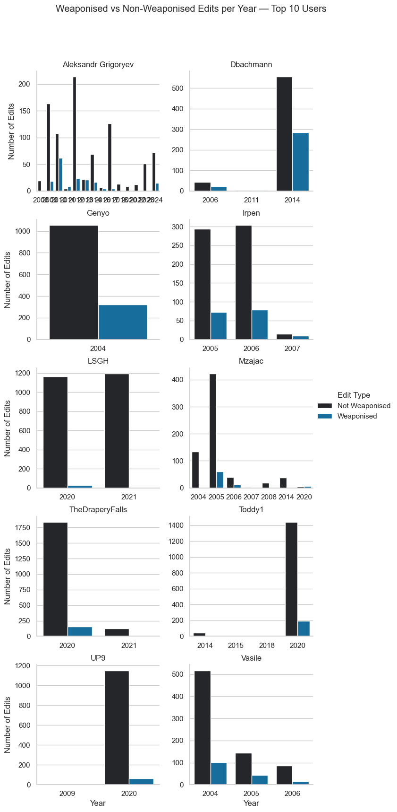

# 🧾 Results — Midterm Analysis (16 Oct. 2025)

## 1. Motivation  

In the file `Wikipedia_articles.txt`, we gathered around **340 Wikipedia articles** related to **Ukrainian and Russian culture, history, and politics**.  

By retrieving all the edits made to these articles, we aim to identify **patterns of activity** — for instance, peaks in editing activity during major historical or geopolitical events.  


### Observed Peaks of Activity

Distinct peaks can be identified around several key periods:

- **2005–2008** → Post–Orange Revolution period, marked by Russo-Ukrainian gas disputes and general geopolitical tension. This era also coincides with Wikipedia’s “golden age,” with roughly **50,000 active users** at its 2007 peak.  
- **2014** → The **Russian annexation of Crimea**.  
- **2020–2021** → The **COVID-19 pandemic**, which likely increased online activity overall.  
- **2022–2025** → The **large-scale Russian invasion of Ukraine**, generating global attention and narrative conflict.  

These observations motivate a deeper investigation into **editor behavior and content modification patterns**.

---

## 2. Research Structure  

This midterm analysis is divided into three complementary parts:

1. **Weaponised vs. Non-Weaponised User Analysis**  
   A global overview of editing patterns among a sample of **2,454 unique users**, distinguishing between edits classified as *weaponising* or *non-weaponising*.

2. **Weaponising Users — Fine-Grained Analysis**  
   A focused investigation of **300 unique users** from the *fine-grained dataset*, restricted to edits identified as weaponising by the language model.

3. **User Case Studies (Data Stories)**  
   Qualitative exploration of **two individual users** with consistent editing activity across Ukraine-related pages.

---

## 3. Weaponised vs. Non-Weaponised User Analysis  

This section is based on the file `matched_edits_all.csv`, produced by **Emanuela**, which aligns fine-grained edits with corresponding user data from the *LLM Results* folder.  
One can first check how *Weaponising* VS *Non weaponsing* edits are distributed over time.


There is a clear correlation with the first graph, showing more edits on crucial geopolitical periods as well as a peak of weaponsing edits. 

### Metadata of the `matched_edits_all.csv`

```python
{'total_edits': 45697,
 'total_unique_users': 2454,
 'number_unique_articles': 41,
 'num_bot_users': 92,
 'num_anonymous_users': 1011,
 'num_registered_users': 1351,
 'num_bot_edits': 1376,
 'num_anonymous_edits': 8315,
 'num_registered_edits': 36006,
 'weaponised_edits': 8388,
 'non_weaponised_edits': 37278,
 'unknown_weaponised_edits': 31}
```

There is a lot we can analyse coming from this metadata. We first start to focus on the **registered** users and specially the top 10 most frequeent editors among the 1351 registered users.

### Top 10 users general info

The top 10 registered editors are : 
```python
['LSGH',
 'Toddy1',
 'TheDraperyFalls',
 'UP9',
 'Genyo',
 'Aleksandr Grigoryev',
 'Dbachmann',
 'Vasile',
 'Irpen',
 'Mzajac']
```

#### Block Info 

In this top 10, no user are blocked. Those users seem to be WP large contributors that are mostly not weaponsing and don't focus only on Ukraine / Russia article.

#### Proportion regarding Ur/Ru articles

I used a small and large sets of ukraine/russia related keywords in order to filter articles that are related to Ur / Ru. 
```python
ukraine_keywords_small = [
    "ukraine", "ukrainian", "kyiv", "kiev", "crimea", "crimean", "kuban", "donbas", "donetsk", "luhansk",
    "maidan", "yanukovych", "yushchenko", "zelenskyy", "poroshenko", "catherine", "bukovina", "bessarabia", "eastern",
    "euromaidan", "dnipro", "odessa", "sevastopol", "putin", "rus'", "russia", "russian", "moscow", "kremlin", "soviet"
]

ukraine_keywords_large = [
    # core country and people
    "ukraine", "ukrainian", "kyiv", "kiev", "crimea", "crimean", "kuban", "donbas", "donetsk", "luhansk",
    "maidan", "yanukovych", "yushchenko", "zelenskyy", "poroshenko", "catherine", "bukovina", "bessarabia",
    "eastern", "euromaidan", "dnipro", "odessa", "sevastopol", "putin", "rus'", "russia", "russian", "moscow",
    "kremlin", "soviet",

    # politics & government
    "verkhovna rada", "president", "prime minister", "parliament", "government", "cabinet", "federation",
    "referendum", "annexation", "independence", "revolution", "reforms", "corruption", "sanctions",
    "occupation", "treaty", "agreement", "ceasefire", "negotiations", "elections", "coup", "unification",

    # geography & regions
    "zaporizhzhia", "mariupol", "kharkiv", "kherson", "mykolaiv", "chernihiv", "sumy", "poltava", "vinnytsia",
    "lviv", "ivano-frankivsk", "ternopil", "lutsk", "uzhhorod", "dnipropetrovsk", "donetsk oblast",
    "luhansk oblast", "transcarpathia", "prykarpattia", "galicia", "novorossiya", "black sea", "azov sea",

    # historical references
    "kyivan rus", "tsar", "imperial", "empire", "ussr", "communist", "lenin", "stalin", "bolshevik",
    "cold war", "perestroika", "glasnost", "collapse", "partition", "catherine the great", "brezhnev",
    "chernobyl", "orange revolution", "revolution of dignity", "holodomor", "soviet union",

    # war and military
    "invasion", "occupation", "annexed", "frontline", "offensive", "defense", "army", "forces", "military",
    "russian troops", "ukrainian forces", "separatist", "rebels", "paramilitary", "nato", "eu", "un", "war",
    "conflict", "shelling", "bombing", "airstrike", "occupation forces", "mobilization", "martial law",

    # culture, identity & language
    "language", "identity", "heritage", "culture", "orthodox", "church", "patriarch", "ukrainian language",
    "russian language", "minority", "bilingual", "autonomy", "nationalism", "independence day", "flag",
    "anthem", "symbol", "national identity", "sovereignty",

    # current / modern references
    "donbas war", "russian invasion", "ukrainian front", "crimea bridge", "moskva cruiser", "ukrainian army",
    "russian army", "zelensky", "kremlin propaganda", "occupation administration", "territorial defense",
    "european union", "eu membership", "nato membership", "nato expansion", "eu sanctions", "ukraine war",
    "full-scale invasion", "special military operation", "mobilisation", "referendum in crimea",

    # other
    "gas pipeline", "north stream", "energy crisis", "grain corridor", "black sea fleet", "peace talks",
    "donetsk people's republic", "luhansk people's republic", "kyiv oblast", "liberation", "resistance",
    "occupation zone", "ukrainian refugees", "mariupol steel plant", "azovstal", "bucha", "irpin", "kharkiv offensive"
]
```

I did the analysis for a sub sample of 1000 analysis per user and for all the edits the user made since the creation of his account. 

With the small set for 1000 edits per user :


With the large set for 1000 edits per user :


With the small set for every edits per user :


With the large set for every edits per user :


#### Weaponsing edits vs non weaponising edits per year for top 10




#### Groups

| Group               | Who it includes   | Typical criteria     | Can edit semi-protected pages? | Can edit extended-protected pages? |
| ------------------- | ----------------- | -------------------- | ------------------------------ | ---------------------------------- |
| `*`                 | Anyone (even IPs) | none                 | ❌                             | ❌                                 |
| `user`              | Registered users  | account created      | ✅                             | ❌                                 |
| `autoconfirmed`     | Older + ≥10 edits | ~4 days, ≥10 edits   | ✅                             | ❌                                 |
| `extendedconfirmed` | Sustained editors | ≥30 days, ≥500 edits | ✅                             | ✅                                 |


### Registered vs IP adress users

The file, as displayed in the metadata, includes 2,454 unique users, of which:
* 1,351 are registered accounts
* 1,011 are anonymous (IP addresses)
* 92 are bots
  
Although the number of registered and anonymous users is roughly comparable, the volume of edits differs significantly:
* Registered users: 36,006 edits
* Anonymous users: 8,315 edits

This implies that registered users contribute over four times more edits than anonymous users. Thus we can raise the following research question
> **Are anonymous (IP address) users more likely to produce weaponising edits compared to registered users due to their anonymity?**

By using an IP Geolocation API, we can check wether the used IP adress is from a proxy or not and where the edit is located :


---

## 3. Weaponised User Analysis  


