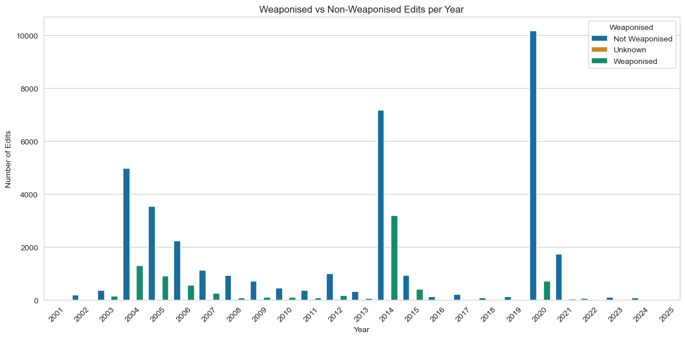
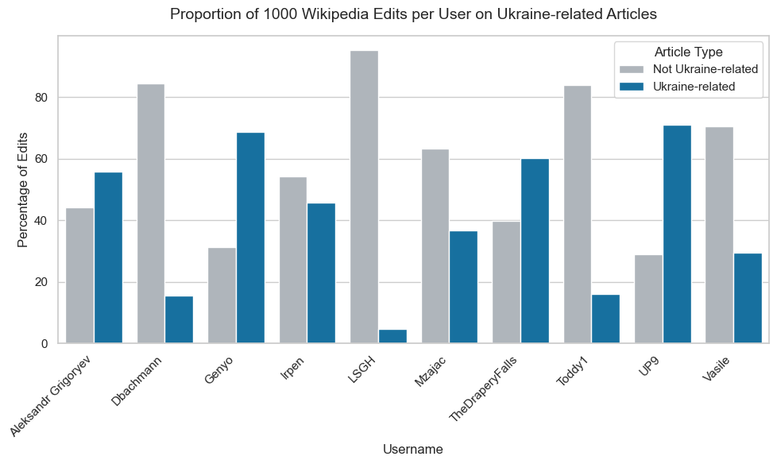
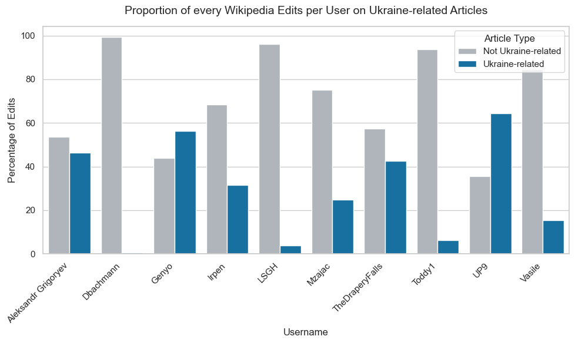
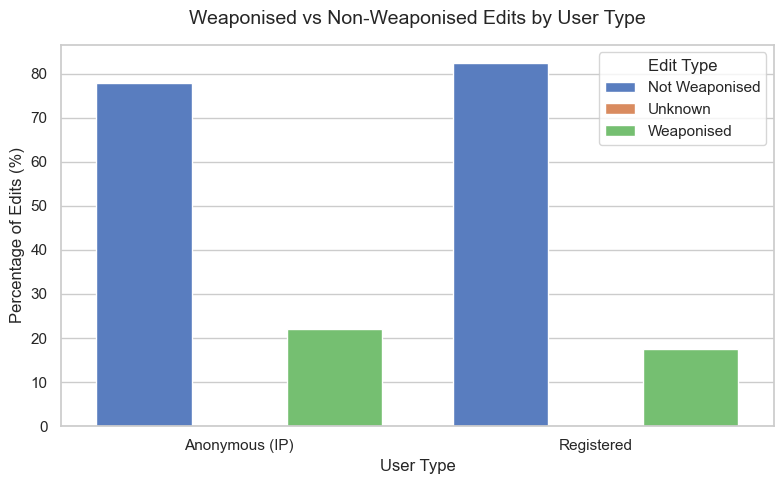
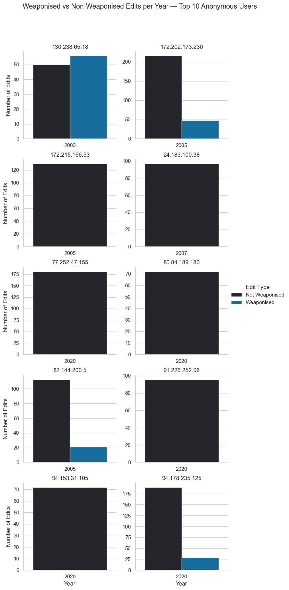

# 🧾 Results — Midterm Analysis (16 Oct. 2025)

## 1. Motivation  

In the file `Wikipedia_articles.txt`, we gathered around **340 Wikipedia articles** related to **Ukrainian and Russian culture, history, and politics**.  

By retrieving all the edits made to these articles, we aim to identify **patterns of activity** — for instance, peaks in editing activity during major historical or geopolitical events.  


### Observed Peaks of Activity

Distinct peaks can be identified around several key periods:

- **2005–2008** → Post–Orange Revolution period, marked by Russo-Ukrainian gas disputes and general geopolitical tension. This era also coincides with Wikipedia’s “golden age,” with roughly **50,000 active users** at its 2007 peak.  
- **2014** → The **Russian annexation of Crimea**.  
- **2020–2021** → The **COVID-19 pandemic**, which likely increased online activity overall.  
- **2022–2025** → The **large-scale Russian invasion of Ukraine**, generating global attention and narrative conflict.  

These observations motivate a deeper investigation into **editor behavior and content modification patterns**.

---

## 2. Research Structure  

This midterm analysis is divided into two complementary parts:

1. **Weaponised vs. Non-Weaponised User Analysis**  
   A global overview of editing patterns among a sample of **2,454 unique users**, distinguishing between edits classified as *weaponising* or *non-weaponising*.

2. **Weaponising Users — Fine-Grained Analysis**  
   A focused investigation of **300 unique users** from the *fine-grained dataset*, restricted to edits identified as weaponising by the language model.

---

## 3. Weaponised vs. Non-Weaponised User Analysis  

This section is based on the file `matched_edits_all.csv`, produced by **Emanuela**, which aligns fine-grained edits with corresponding user data from the *LLM Results* folder.  
One can first check how *Weaponising* VS *Non weaponsing* edits are distributed over time.



There is a clear correlation with the first graph, showing more edits on crucial geopolitical periods as well as a peak of weaponsing edits. No peaks are displayed for the 2022-2025 periods since no article in the dataset was about Russian large scale invasion in Ukraine.

### Metadata of the `matched_edits_all.csv`

```python
{'total_edits': 45697,
 'total_unique_users': 2454,
 'number_unique_articles': 41,
 'num_bot_users': 92,
 'num_anonymous_users': 1011,
 'num_registered_users': 1351,
 'num_bot_edits': 1376,
 'num_anonymous_edits': 8315,
 'num_registered_edits': 36006,
 'weaponised_edits': 8388,
 'non_weaponised_edits': 37278,
 'unknown_weaponised_edits': 31}
```

There is a lot we can analyse coming from this metadata. We first start to focus on the **registered** users and specially the top 10 most frequent editors among the 1351 registered users.

### Top 10 users general info

The top 10 registered editors are : 
```python
['LSGH',
 'Toddy1',
 'TheDraperyFalls',
 'UP9',
 'Genyo',
 'Aleksandr Grigoryev',
 'Dbachmann',
 'Vasile',
 'Irpen',
 'Mzajac']
```

#### Proportion regarding Ur/Ru articles

To identify how much each of the top 10 users focused on Ukraine- or Russia-related content, I filtered their edited articles using both small and large sets of keywords related to these two countries.

```python
ukraine_keywords_small = [
    "ukraine", "ukrainian", "kyiv", "kiev", "crimea", "crimean", "kuban", "donbas", "donetsk", "luhansk",
    "maidan", "yanukovych", "yushchenko", "zelenskyy", "poroshenko", "catherine", "bukovina", "bessarabia", "eastern",
    "euromaidan", "dnipro", "odessa", "sevastopol", "putin", "rus'", "russia", "russian", "moscow", "kremlin", "soviet"
]

ukraine_keywords_large = [
    # core country and people
    "ukraine", "ukrainian", "kyiv", "kiev", "crimea", "crimean", "kuban", "donbas", "donetsk", "luhansk",
    "maidan", "yanukovych", "yushchenko", "zelenskyy", "poroshenko", "catherine", "bukovina", "bessarabia",
    "eastern", "euromaidan", "dnipro", "odessa", "sevastopol", "putin", "rus'", "russia", "russian", "moscow",
    "kremlin", "soviet",

    # politics & government
    "verkhovna rada", "president", "prime minister", "parliament", "government", "cabinet", "federation",
    "referendum", "annexation", "independence", "revolution", "reforms", "corruption", "sanctions",
    "occupation", "treaty", "agreement", "ceasefire", "negotiations", "elections", "coup", "unification",

    # geography & regions
    "zaporizhzhia", "mariupol", "kharkiv", "kherson", "mykolaiv", "chernihiv", "sumy", "poltava", "vinnytsia",
    "lviv", "ivano-frankivsk", "ternopil", "lutsk", "uzhhorod", "dnipropetrovsk", "donetsk oblast",
    "luhansk oblast", "transcarpathia", "prykarpattia", "galicia", "novorossiya", "black sea", "azov sea",

    # historical references
    "kyivan rus", "tsar", "imperial", "empire", "ussr", "communist", "lenin", "stalin", "bolshevik",
    "cold war", "perestroika", "glasnost", "collapse", "partition", "catherine the great", "brezhnev",
    "chernobyl", "orange revolution", "revolution of dignity", "holodomor", "soviet union",

    # war and military
    "invasion", "occupation", "annexed", "frontline", "offensive", "defense", "army", "forces", "military",
    "russian troops", "ukrainian forces", "separatist", "rebels", "paramilitary", "nato", "eu", "un", "war",
    "conflict", "shelling", "bombing", "airstrike", "occupation forces", "mobilization", "martial law",

    # culture, identity & language
    "language", "identity", "heritage", "culture", "orthodox", "church", "patriarch", "ukrainian language",
    "russian language", "minority", "bilingual", "autonomy", "nationalism", "independence day", "flag",
    "anthem", "symbol", "national identity", "sovereignty",

    # current / modern references
    "donbas war", "russian invasion", "ukrainian front", "crimea bridge", "moskva cruiser", "ukrainian army",
    "russian army", "zelensky", "kremlin propaganda", "occupation administration", "territorial defense",
    "european union", "eu membership", "nato membership", "nato expansion", "eu sanctions", "ukraine war",
    "full-scale invasion", "special military operation", "mobilisation", "referendum in crimea",

    # other
    "gas pipeline", "north stream", "energy crisis", "grain corridor", "black sea fleet", "peace talks",
    "donetsk people's republic", "luhansk people's republic", "kyiv oblast", "liberation", "resistance",
    "occupation zone", "ukrainian refugees", "mariupol steel plant", "azovstal", "bucha", "irpin", "kharkiv offensive"
]
```

I did the analysis for a sub sample of 1000 analysis per user and for all the edits the user made since the creation of his account using Wikipedia's user API. 

With the small set for 1000 edits per user :

<p align="center">

</p>

With the large set for 1000 edits per user :

<p align="center">

</p>

With the small set for every edits per user :

<p align="center">

</p>

With the large set for every edits per user :

<p align="center">

</p>

#### Weaponsing edits vs non weaponising edits per year for top 10 for only Ur/Ru related article

<p align="center">

</p>

The graph shows that while Dbachmann seldom edits Ukraine- or Russia-related pages, those few edits are more likely to be weaponising compared to others.
In general, these top users are broad Wikipedia contributors, with limited focus on Ukraine/Russia topics and little evidence of weaponising behaviour.

#### Groups

| Group               | Who it includes   | Typical criteria     | Can edit semi-protected pages? | Can edit extended-protected pages? |
| ------------------- | ----------------- | -------------------- | ------------------------------ | ---------------------------------- |
| `*`                 | Anyone (even IPs) | none                 | ❌                             | ❌                                 |
| `user`              | Registered users  | account created      | ✅                             | ❌                                 |
| `autoconfirmed`     | Older + ≥10 edits | ~4 days, ≥10 edits   | ✅                             | ❌                                 |
| `extendedconfirmed` | Sustained editors | ≥30 days, ≥500 edits | ✅                             | ✅                                 |

> hard to get some relevant information for only the top 10 users. Maybe will me more relevant when focus only on the weaponising users for the fiengrained file.

### Registered vs IP adress users

The file, as displayed in the metadata, includes 2,454 unique users, of which:
* 1,351 are registered accounts
* 1,011 are anonymous (IP addresses)
* 92 are bots
  
Although the number of registered and anonymous users is roughly comparable, the volume of edits differs significantly:
* Registered users: 36,006 edits
* Anonymous users: 8,315 edits

This implies that registered users contribute over four times more edits than anonymous users. Thus we can raise the following research question
> **Are anonymous (IP address) users more likely to produce weaponising edits compared to registered users due to their anonymity?**

The graph below shows that in proportion, IP adress user are slighlty more weaponsing than registered user. They feel maybe more confortable to weaponise under anonymity.

<p align="center">

</p>

As we did for the top 10 registered users, we can also see how much edits and when the top 10 anonymous users are weaponising or not. As seen in the plot, we can see that the numbers of edits is way lower than the top 10 registered user and all of the top 10 IP adresse without exception are pnly editing during a single year, whcih is different than the registered users where the most of them are editing for a longer time frame.

<p align="center">

</p>

#### Quantify intensity

One can continue to quantify the intensity of the edits by answering this next question : 
> Do IP addresses are more like one time edit than registered user who seems to edit be more active in long-term.

> Do IP address editors are more concise and harmful than registered users ?
We can perform a histogram of edits magbnitude per user type by checking the lenght of the ```changed_version``` vs the length of the ```inital_version```

By using the work of Dangzhi Zhao, we can use a ```controverersial```tag when webscraping the user talk page to detect debates/conflicts.
They also used a cryptographic checksums : used to detect reverts (if two versions are identical, it means one editor reverted to an older state). One can check if the IP adresses are more likely to be reverted than the registered users. 

One can also assess the lexical polarity between weaponising edits between the two user type. By using a sentiment analyser like VADER, we can output the distribution of the polarity score. 

#### Exploring networks 

The goal is to find potential echo-chambers. In order to do that, we can make two different graphs :
* User-Article bepartite graph : who edits whats. Joins the idea of creating a big map of user and articles to see potential clusters of editors.
* User-user projection : users connected if they edited the same article. Try to see if it's possible to do temporal co-editing : users editing same pages in similar time windows (possible coordination)

See article from Jun Liu and Sanmay Das. 
Since Das et. al showed that some people are waiting to being upgraded to administrators status in order to focus more on controversial WP articles and promote their own POV by editing the article or doing the police

By using an IP Geolocation API, we can check wether the used IP adress is from a proxy or not and where the edit is located :

🌍 [View Interactive IP Map](https://maximegrmbs.github.io/dhlab-cultural-weaponisation-ukraine-benchmark/blob/main/plots/ip_locations_map.html)

---

## 3. Weaponised User Analysis  


## Track the .csv files 
```
all_user_profiles.csv             # Keeps the top10 user metadata gathered with WP user API.
matched_edits_all.csv             # All the ngrams that matched with a weaponising or non weaponising edits.
all_user_contribs_sub_n=1000.csv  # Sub-sample of 1000 contributions of top10 user gathered by WP user contrib API.
all_user_contribs.csv             # All contributions of top10 user gathered by WP user contrib API.
```


